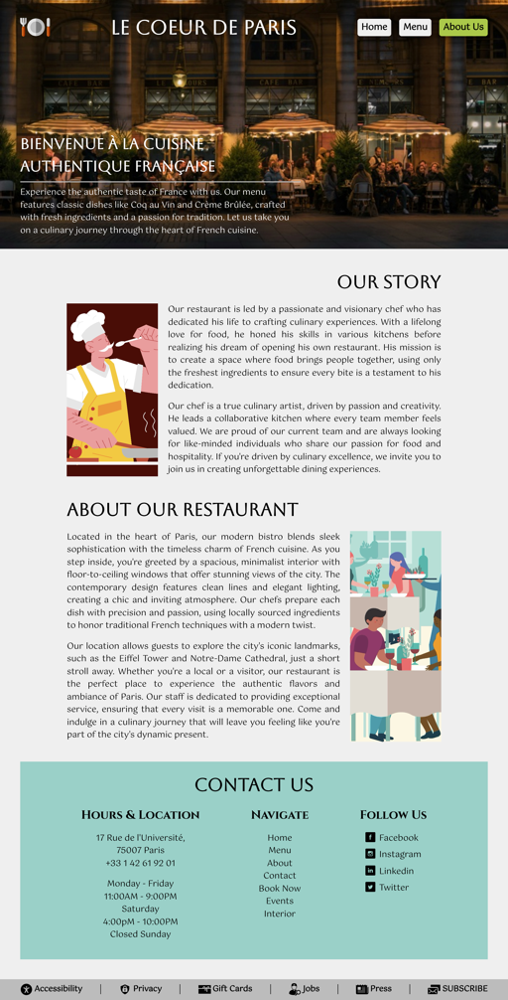

# The Odin Project - Restaurant Page solution

This is a solution for the [Restaurant Page project on The Odin Project](https://www.theodinproject.com/lessons/node-path-javascript-restaurant-page)

## Table of contents

- [The Odin Project - Restaurant Page solution](#the-odin-project---restaurant-page-solution)
  - [Table of contents](#table-of-contents)
  - [Overview](#overview)
    - [Screenshots](#screenshots)
      - [Homepage](#homepage)
      - [Menu](#menu)
      - [About Us](#about-us)
    - [Links](#links)
    - [Useful resources](#useful-resources)
  - [Acknowledgments](#acknowledgments)

## Overview

This project is a simple web page for a restaurant. It is built using HTML, CSS, JS and Webpack. The goal of this project is to practice using Webpack and render content dynamically using JS modules. 

I chose to create a mockup of a french restaurant page for this project. The page has navigation buttons for Home, Menu, and About. The content is rendered dynamically based on the button that is clicked. Homepage contains a welcome message and a gallery of images denoting various features of the restaurant. Menu is further divided into Lunch, Dinner and Drinks. Please click the buttons to see the related menu items. About page contains information about the restaurant and contact details. 

### Screenshots

#### Homepage

####  Menu

#### About Us

### Links

- Solution URL: [https://github.com/py-code314/restaurant-page](https://github.com/py-code314/restaurant-page)
- Live Site URL: 

### Useful resources
- To create accessible tabs - https://wesbos.com/javascript/06-serious-practice-exercises/tabs

## Acknowledgments
