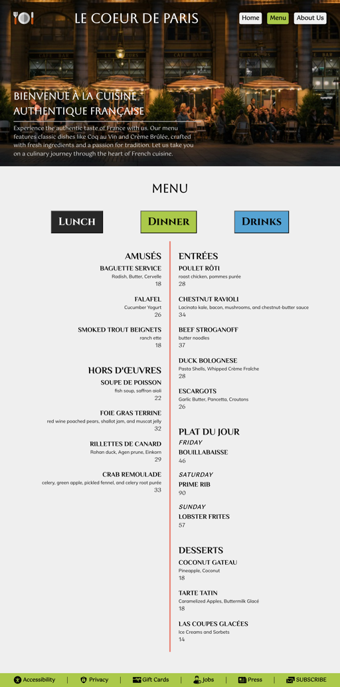

# The Odin Project - Restaurant Page solution

This is a solution for the [Restaurant Page project on The Odin Project](https://www.theodinproject.com/lessons/node-path-javascript-restaurant-page)

## Table of contents

- [The Odin Project - Restaurant Page solution](#the-odin-project---restaurant-page-solution)
  - [Table of contents](#table-of-contents)
  - [Overview](#overview)
    - [Screenshots](#screenshots)
      - [Homepage](#homepage)
      - [Menu](#menu)
      - [About Us](#about-us)
    - [Links](#links)
    - [Useful resources](#useful-resources)
  - [Acknowledgments](#acknowledgments)
    - [Icons](#icons)
    - [Images](#images)

## Overview

This project is a simple web page for a restaurant. It is built using HTML, CSS, JS and Webpack. The goal of this project is to practice using Webpack and render content dynamically using JS modules. 

I chose to create a mockup of a french restaurant page for this project. The page has navigation buttons for Home, Menu, and About. The content is rendered dynamically based on the button that is clicked. Homepage contains a welcome message and a gallery of images denoting various features of the restaurant. Menu is further divided into Lunch, Dinner and Drinks. Please click the buttons to see the related menu items. About page contains information about the restaurant and contact details. 

### Screenshots

#### Homepage

####  Menu

#### About Us

### Links

- Solution URL: [https://github.com/py-code314/restaurant-page](https://github.com/py-code314/restaurant-page)
- Live Site URL: [https://py-code314.github.io/restaurant-page/](https://py-code314.github.io/restaurant-page/)

### Useful resources
- This [Tabs](https://wesbos.com/javascript/06-serious-practice-exercises/tabs) exercise by Wes Bos was very helpful in understanding how to connect the navigation buttons to the content.

## Acknowledgments

### Icons
1. All icons are from [SVG Repo](https://www.svgrepo.com/) website.

### Images
1. Header Background Image (image-restaurant-2.jpeg) - "turned-on canopy lights" by Siyuan on [Unsplash](https://unsplash.com/photos/turned-on-canopy-lights-g_V2rt6iG7A)
2. Restaurant link Background Image (image-restaurant-1.jpeg) - "dining table and chair set under four lighted pendant lamps" by Bundo Kim on [Unsplash](https://unsplash.com/photos/dining-table-and-chair-set-under-four-lighted-pendant-lamps-Pb9bUzH1nD8)
3. Menu link Background Image (image-menu.jpeg) - "Scallop Appetizer" by Kamil Kalbarczyk on [Unsplash](https://unsplash.com/photos/shallow-focus-photography-of-meat-with-vegetables-19Ft3QfakMo)
4. Bar link Background Image (image-bar.jpeg) - "clear cocktail glass on table" by Klara Kulikova on [Unsplash](https://unsplash.com/photos/clear-cocktail-glass-on-table-CrcW77QOH00)
5. Chef link Background Image (image-chef.jpeg) - "man standing front of plate with vegetable" by Jason Leung on [Unsplash](https://unsplash.com/photos/man-standing-front-of-plate-with-vegetable--eKZLpj7U0E)
6. Chocolates link Background Image (image-chocolates.jpeg) - "a table topped with chocolate and nuts" by Alina Parache on [Unsplash](https://unsplash.com/photos/a-table-topped-with-chocolate-and-nuts-BypPgofw-1w)
7. Events link Background Image (image-events.jpeg) - "two glass bottles on white table" by tabitha turner on [Unsplash](https://unsplash.com/photos/two-glass-bottles-on-white-table-XRGQe2ySvsM)
8. Our Story Image (image-chef-1.jpeg) - "A man in a chef's outfit cooking on a grill" by Fast Studio on [Unsplash](https://unsplash.com/illustrations/a-man-in-a-chefs-outfit-cooking-on-a-grill-Oyslr_PiPg0)
9. About Our Restaurant Image (image-restaurant-1.jpeg) - "Interior of elegant restaurant" by freepik on [Freepik](https://www.freepik.com/free-vector/interior-elegant-restaurant_3336233.htm#fromView=search&page=5&position=7&uuid=4203fdc1-360e-447b-a80a-67bf39d067a5&query=Restaurant+Illustration)

